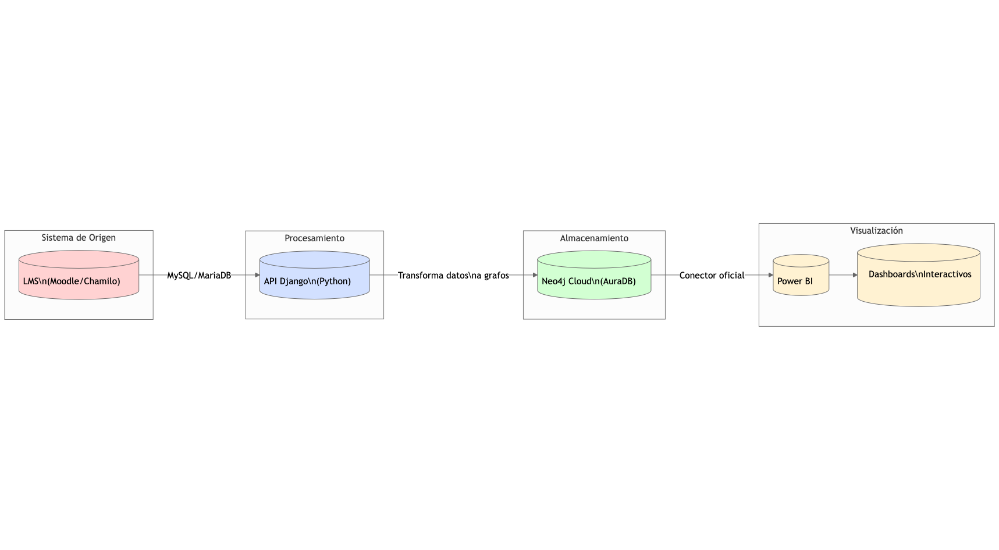

# Grafo de Conocimiento para Evaluación del Proceso de Aprendizaje en Entornos eLearning

**Proyecto Final de Tesis**  
Maestría en Ciencias en Ingeniería de Software Informático  
**Estudiante:** Jesús A. Samaniego M. - Cédula: 8-864-7  

---

## 🚀 Descripción del Proyecto

Este repositorio contiene el desarrollo de un **grafo de conocimiento** diseñado para evaluar el proceso de aprendizaje en entornos eLearning (específicamente Moodle). El sistema integra:

- Una ontología educativa formalizada en Protégé
- Datos extraídos de LMS Moodle mediante consultas SQL
- Un API REST en Django para transformación y migración de datos
- Base de datos en Neo4j para representar el grafo de conocimiento
- Consultas Cypher para análisis y visualización en PowerBI

---

## 🔍 Objetivos Principales

1. Modelar un **grafo de conocimiento** que represente relaciones complejas en procesos educativos
2. Automatizar la extracción y transformación de datos desde Moodle a Neo4j
3. Generar **indicadores visuales** del aprendizaje mediante PowerBI
4. Proporcionar una base para **análisis predictivos** en educación virtual

---

## 🛠️ Arquitectura y Tecnologías



**Stack Tecnológico:**
- **Ontología:** Protégé (OWL/RDF)
- **Extracción de Datos:** MySQL (Moodle), Python
- **API y Transformación:** Django REST Framework
- **Grafo de Conocimiento:** Neo4j (Cypher)
- **Visualización:** PowerBI
- **Control de Versiones:** Git/GitHub

---

## 📂 Estructura del Repositorio

```
├── ontologia/            # Ontología educativa y documentación
├── extraccion-datos/     # Scripts SQL para Moodle
├── api-django/           # API para migración de datos
├── neo4j/                # Scripts Cypher y configuración
├── powerbi/              # Consultas y dashboards
└── docs/                 # Documentación técnica y académica
```

---

## 🏁 Primeros Pasos

1. **Clonar el repositorio:**
   ```bash
   git clone https://github.com/jsamaniego-22/tesis-grafo-conocimiento.git
   ```

2. **Configurar entornos:**
   - Instalar dependencias en `api-django/requirements.txt`
   - Importar ontología en Protégé desde `ontologia/protege/`
   - Configurar conexiones a Neo4j en `neo4j/config/`

---

## 📊 Resultados Esperados

- **Modelo de grafo** que relacione: estudiantes, actividades, competencias y resultados
- **Dashboard interactivo** con métricas de aprendizaje
- **Documentación académica** completa del proceso

---

## 📬 Contacto

**Autor:** Jesús A. Samaniego M.  
**Correo:** desarrollosjasm@gmail.com  
**Universidad:** [Nombre de tu Universidad]  

*"Transformando datos educativos en conocimiento accionable"*  

---

🔹 *Este proyecto es parte de los requisitos para optar por el título de Magíster en Ciencias en Ingeniería de Software Informático*  

[](https://opensource.org/licenses/MIT)  

*Última actualización: [fecha]*  

---

### ✨ ¿Cómo contribuir?

Si deseas colaborar o usar este proyecto como referencia:
1. Abre un *issue* para discutir mejoras
2. Haz *fork* del repositorio
3. Sigue las guías de estilo en `docs/CONTRIBUTING.md`

*¡El conocimiento crece cuando se comparte!*